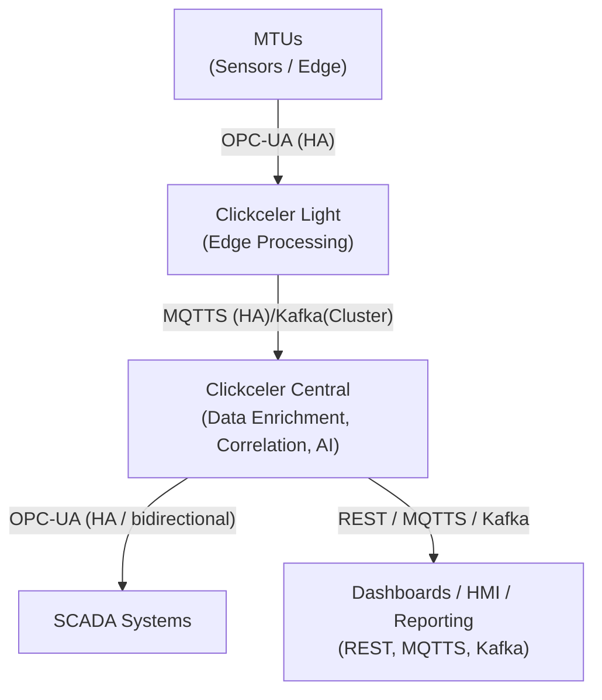

# Clickceler Mid-Term Plan for Industrial Operations (12–24 months)

## 1. Vision & Objectives
- Position Clickceler platform for industrial observability**.  
- Enable **real-time monitoring, enrichment, correlation, and automation** across industrial SCADA and IT systems.  
- Maintain **open-source accessibility** while leveraging expert knowledge in AI, SCADA and Observability systems.  
- Ensure **security and compliance** with modern authentication and cybersecurity standards.  

---

## 2. Key Strategic Pillars

### A. Technical Maturity
- Deploy Clickceler on **modern SCADA architectures** with smart devices, MTUs, and edge computing.  
- Integrate **MQTTS, Kafka, OPC-UA** for data ingestion and real-time event processing.  
- Enhance **dashboard clarity, visualization, and decision-support tools**.  
- Implement **real-time local enrichment and automation** before propagating to Control Centers.  

### B. Security & Compliance
- Enforce **password best practices and multi-factor authentication**.  
- Ensure **secure data transfer** via encrypted protocols (TLS/SSL).  
- Regularly audit for **industrial cybersecurity compliance** (ISA/IEC 62443, NIST, etc.).  

### C. Industrial Observability & AI Integration
- Correlate data from **SCADA, IoT sensors, and high-tech IT systems**.  
- Enable **predictive analytics and anomaly detection** using AI.  
- Provide **pre-consolidated dashboards** for faster operational decision-making.  

### D. Adoption & Expertise
- Train internal teams and partners on **Clickceler’s open-source platform**.  
- Build a **community of experts** who understand AI and SCADA evolution.  
- Create **documentation, use-cases, and tutorials** for industrial adoption.  

---

## 3. Roadmap (12–24 months)

| Timeline      | Goals & Deliverables |
|---------------|--------------------|
| **Months 1–3**  | Audit current SCADA & IT infrastructure. Identify critical MTUs, sensors, and data flows. Set up Clickceler sandbox environment. |
| **Months 4–6**  | Integrate **MQTTS, Kafka**, and edge processing. Deploy initial dashboards and visualization tools. |
| **Months 7–12** | Implement **real-time local enrichment, correlation, and automation**. Apply cybersecurity best practices. Conduct first pilot with operational teams. |
| **Months 13–18**| Expand to multiple production lines/sites. Integrate AI-based analytics for predictive maintenance and anomaly detection. |
| **Months 19–24**| Optimize **pre-consolidated dashboards** for Control Centers. Evaluate ROI, fine-tune automation rules, and scale adoption across organization. |

---

## 4. Success Metrics
- **Operational visibility:** % of critical assets monitored in real-time.  
- **Incident response time:** Reduction in detection-to-action latency.  
- **Automation coverage:** % of events automatically enriched, correlated, or acted upon locally.  
- **User adoption:** # of trained operators and analysts actively using Clickceler.  
- **Security compliance:** 100% of access through secure authentication protocols.  

---

## 5. Long-Term Vision
- Position Clickceler as the **standard open source industrial observability platform**, bridging SCADA reliability with AI intelligence.  
- Enable **smart factories and Industry 4.0 operations** with fully **secure, real-time, and automated industrial monitoring**.  

 

