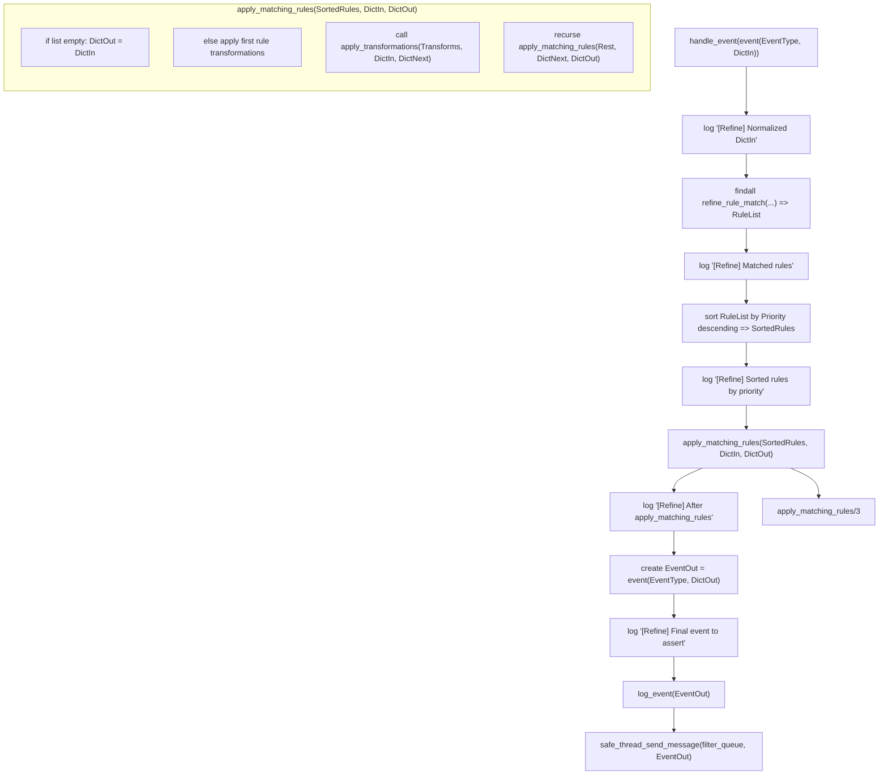

```mermaid
flowchart TD
    A["handle_event(event(EventType, DictIn))"] --> B["log '[Refine] Normalized DictIn'"]
    B --> C["findall refine_rule_match(...) => RuleList"]
    C --> D["log '[Refine] Matched rules'"]
    D --> E["sort RuleList by Priority descending => SortedRules"]
    E --> F["log '[Refine] Sorted rules by priority'"]
    F --> G["apply_matching_rules(SortedRules, DictIn, DictOut)"]
    G --> H["log '[Refine] After apply_matching_rules'"]
    H --> I["create EventOut = event(EventType, DictOut)"]
    I --> J["log '[Refine] Final event to assert'"]
    J --> K["log_event(EventOut)"]
    K --> L["safe_thread_send_message(filter_queue, EventOut)"]

    %% apply_matching_rules details
    G --> M["apply_matching_rules/3"]
    subgraph ApplyRules["apply_matching_rules(SortedRules, DictIn, DictOut)"]
        direction TB
        M1["if list empty: DictOut = DictIn"]
        M2["else apply first rule transformations"]
        M3["call apply_transformations(Transforms, DictIn, DictNext)"]
        M4["recurse apply_matching_rules(Rest, DictNext, DictOut)"]
    end

```
