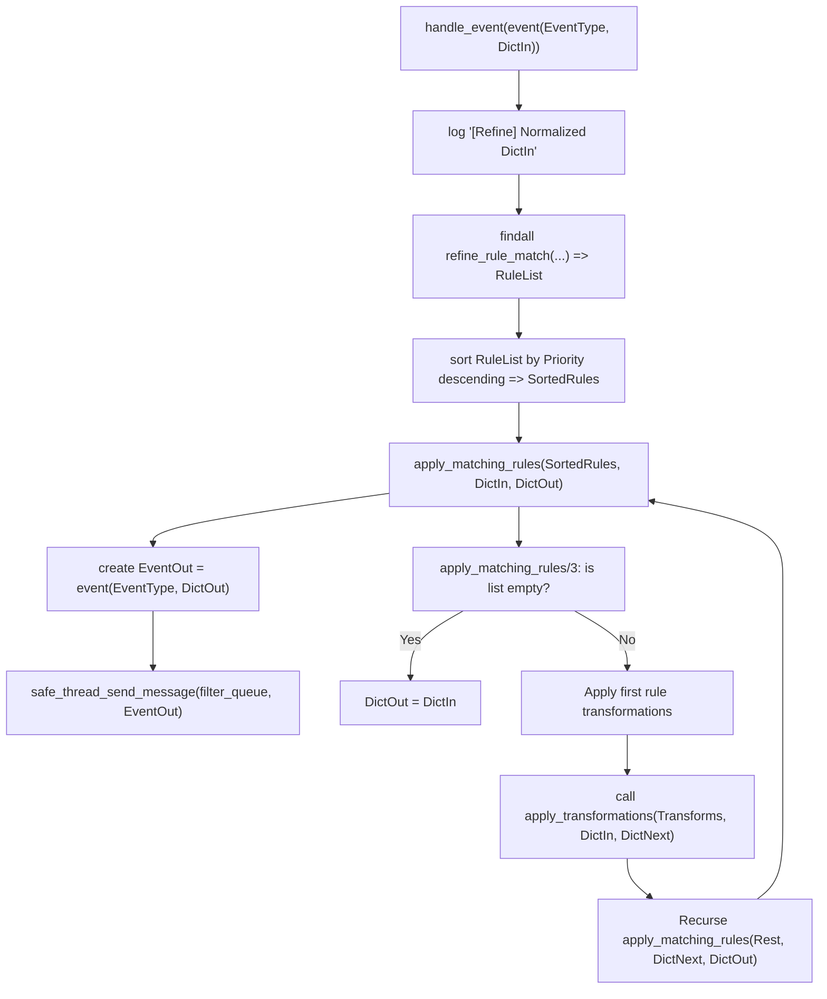

```mermaid
flowchart TD
    A["handle_event(event(EventType, DictIn))"] --> B["log '[Refine] Normalized DictIn'"]
    B --> C["findall refine_rule_match(...) => RuleList"]
    C --> E["sort RuleList by Priority descending => SortedRules"]
    E --> G["apply_matching_rules(SortedRules, DictIn, DictOut)"]
    G --> I["create EventOut = event(EventType, DictOut)"]
    I --> L["safe_thread_send_message(filter_queue, EventOut)"]

    %% Details of apply_matching_rules integrated into main flow
    G --> M1["apply_matching_rules/3: is list empty?"]
    M1 -- Yes --> M2["DictOut = DictIn"]
    M1 -- No --> M3["Apply first rule transformations"]
    M3 --> M4["call apply_transformations(Transforms, DictIn, DictNext)"]
    M4 --> M5["Recurse apply_matching_rules(Rest, DictNext, DictOut)"]
    M5 --> G


```
