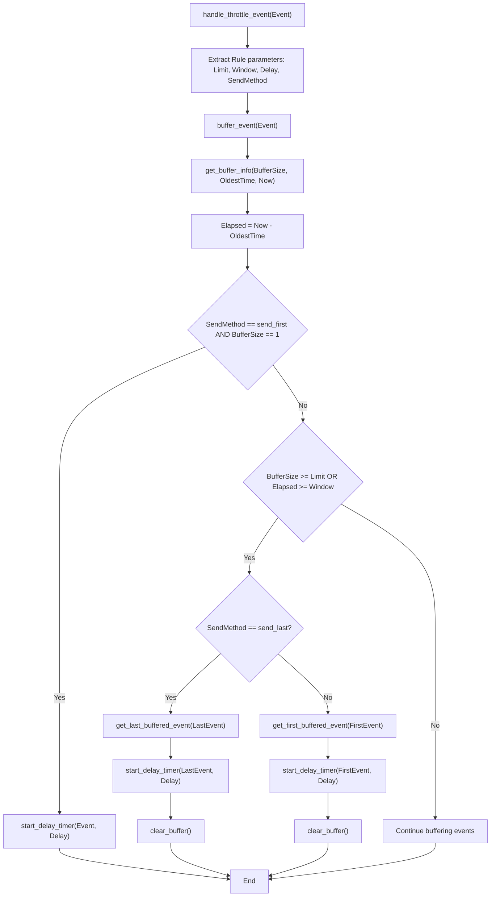

```mermaid
flowchart TD
    A["handle_throttle_event(Event)"] --> B["Extract Rule parameters: Limit, Window, Delay, SendMethod"]
    B --> C["buffer_event(Event)"]
    C --> D["get_buffer_info(BufferSize, OldestTime, Now)"]
    D --> E["Elapsed = Now - OldestTime"]

    %% send_first early send
    E --> F{"SendMethod == send_first AND BufferSize == 1"}
    F -->|Yes| G["start_delay_timer(Event, Delay)"]
    G --> Z["End"]

    %% Check limits
    F -->|No| H{"BufferSize >= Limit OR Elapsed >= Window"}
    H -->|Yes| I{"SendMethod == send_last?"}

    %% send_last branch
    I -->|Yes| J["get_last_buffered_event(LastEvent)"]
    J --> K["start_delay_timer(LastEvent, Delay)"]
    K --> L["clear_buffer()"]
    L --> Z

    %% send_first branch
    I -->|No| M["get_first_buffered_event(FirstEvent)"]
    M --> N["start_delay_timer(FirstEvent, Delay)"]
    N --> O["clear_buffer()"]
    O --> Z

    %% Continue buffering
    H -->|No| P["Continue buffering events"]
    P --> Z

```
