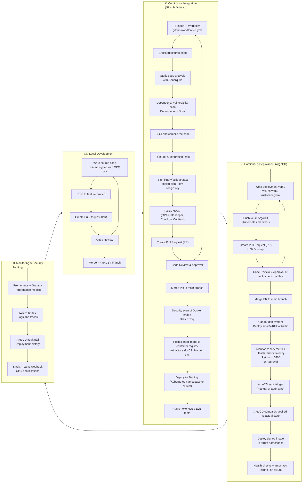

```mermaid


flowchart LR
classDef ghost-node fill:none, stroke:none, color:none, height:0, padding:0, margin:0;

%% ======================
%% DEV
%% ======================
subgraph DEV["🧑‍💻 Local Development"]
A1[Write source code<br>Commit signed with GPG key] --> A2[Push to feature branch]
A2 --> A3["Create Pull Request (PR)"]
A3 --> A4[Code Review]
A4 --> A5[Merge PR to DEV branch]
A4 --> A1
end

%% ======================
%% CI
%% ======================
subgraph CI["⚙️ Continuous Integration<br>(GitHub Actions)"]
CI_SPACER[" "] --- B1[Trigger CI Workflow<br>github/workflows/ci.yml]
class CI_SPACER ghost-node
B1 --> B2[Checkout source code]
B2 --> B3["Static code analysis<br>with Sonarqube"]
B3 --> B4["Dependency vulnerability scan<br>Dependabot + Snyk"]
B4 --> B5[Build and compile the code]
B5 --> B6[Run unit & integration tests]
B6 --> B7[Sign binary/build artifact<br>cosign sign --key cosign.key]
B7 --> B8["Policy check (OPA/Gatekeeper, Checkov, Conftest)"]
B8 --> B10["Create Pull Request (PR)"]
B10 --> B12[Code Review & Approval]
B12 --> B1
B12 --> B13[Merge PR to main branch]
B13 --> B14["Security scan of Docker image<br>Xray / Trivy"]
B14 --> B15["Push signed image to container registry<br>Artifactory, GHCR, Harbor, etc."]
B15 --> S1["Deploy to Staging (Kubernetes namespace or cluster)"]
S1 --> S2["Run smoke tests / E2E tests"]
end

%% ======================
%% CD
%% ======================
subgraph CD["🚀 Continuous Deployment (ArgoCD)"]
CD_SPACER[" "] --- C1[Write deployment.yaml, values.yaml, kustomize.yaml]
class CD_SPACER ghost-node
C1 --> C3[Push to Git ArgoCD Kubernetes manifests]
C3 --> C4["Create Pull Request (PR) in GitOps repo"]
C4 --> C5[Code Review & Approval of deployment manifest]
C5 --> C1
C5 --> C6[Merge PR to main branch]
C6 --> C7["Canary deployment<br>Deploy small5-10% of traffic"]
C7 --> C8["Monitor canary metrics<br>Health, errors, latency"<br>Return to DEV<br>or Approval]
C8 --> C9["ArgoCD sync trigger<br>(manual or auto-sync)"]
C9 --> C10["ArgoCD compares desired vs actual state"]
C10 --> C11["Deploy signed image<br>to target namespace"]
C11 --> C12["Health checks + automatic rollback on failure"]
end

%% ======================
%% MONITORING & AUDIT
%% ======================
subgraph MON["📊 Monitoring & Security<br>Auditing"]
MON_SPACER[" "] --- D1[Prometheus + Grafana<br>Performance metrics]
class MON_SPACER ghost-node
D1 --> D2[Loki + Tempo<br>Logs and traces]
D2 --> D3[ArgoCD audit trail<br>Deployment history]
D3 --> D4[Slack / Teams webhook<br>CI/CD notifications]
end

%% ======================
%% LINKS BETWEEN PHASES
%% ======================
DEV --> CI
CI --> CD
CD --> MON
MON --> DEV


```
