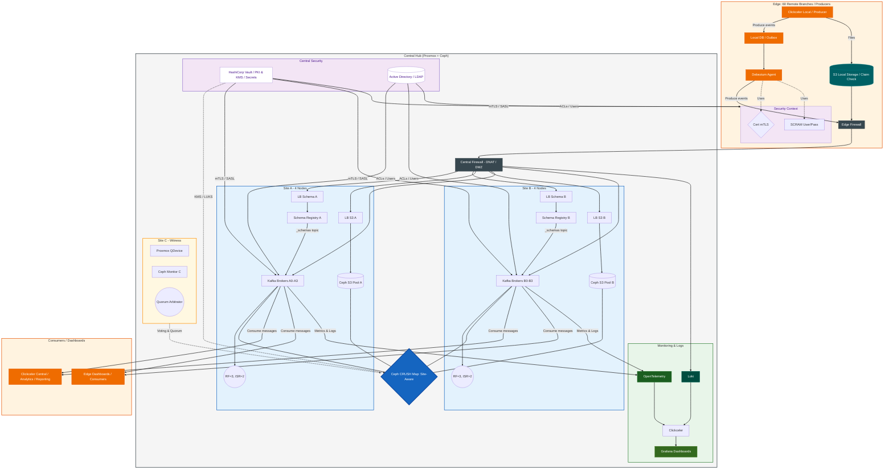

# ARCHITECTURE DOCUMENT: Central Control Data Hub for Clickceler (Open Source Edition)
## Open Source Hybrid Infrastructure Blueprint (Proxmox / Ceph / Kafka)

**Project Identity:** Clickceler Event Management  
**Context:** SCADA / Industry v4.0 Critical Infrastructure  
**Infrastructure Stack:** Proxmox VE 8.x + Ceph Quincy/Reef + Apache Kafka  
**Scope:** 60 Global Edge Branches to Central Stretched Hub  
**Compliance:** Enterprise-Grade HA (RPO=0) & Zero-Trust mTLS Standards

---

## 1. Executive Summary
This document defines an ultra-resilient infrastructure using **Open Source** technologies for real-time security data centralization. The architecture combines a **Proxmox VE Cluster** with **Ceph Distributed Storage** and a Rack-Aware Kafka Cluster.

Emphasis is placed on:
* **Zero Data Loss (RPO=0):** Achieved via Ceph synchronous replication across sites.
* **Vendor Independence:** Leveraging KVM, Ceph, and Linux-native security.
* **Complex Event Handling:** Optimized via Claim Check patterns and S3-compatible storage.

---

## 2. Central Hub: Infrastructure
The central hub consists of **8 high-performance nodes** (4 per site).

### Hardware Specifications
| Component | Technical Details | Business Value |
| :--- | :--- | :--- |
| **Processors** | 2 x Intel® Xeon® Gold 6430 (64 physical cores total per node) | High-throughput message processing & low latency. |
| **Memory** | 512GB DDR5-4800 RAM | Optimized for Ceph OSD caching & Kafka Page Cache. |
| **Storage (OSD)** | 10 x 7.68TB NVMe/SAS SSD per node | Unified Ceph pool (Block & Object storage). |
| **Network Fabric** | Quad-port 25GbE SFP28 | Dedicated links for Ceph Cluster traffic (Replication). |
| **Virtualization** | **Proxmox VE 8.x (KVM/LXC)** | Enterprise-grade HA without licensing overhead. |

---

## 3. Storage & Kafka Alignment (Ceph Stretched Layer)

### 3.1 Ceph CRUSH Map & Quorum
* **Site-Aware Replication:** The Ceph CRUSH map is configured with `Site` as the primary failure domain. Every write is replicated to ensure copies exist on both **Site A** and **Site B**.
* **PFTT=1 (Primary Failure):** The cluster survives the total loss of one site.
* **QDevice (Site C):** A lightweight Proxmox QDevice and Ceph Monitor on Site C act as a tie-breaker to maintain Quorum and prevent split-brain.

### 3.2 Kafka & Storage Architecture
* **Ceph RBD (Block):** Used for Kafka persistent logs.
* **Kafka Rack-Aware:** Brokers are tagged with site locations to ensure partition replicas are never stored on the same site.
* **Net usable capacity:** ~61 TB (after synchronous replication and 25% safety slack).

---

## 4. Advanced Data Reliability Patterns

### 4.1 Edge Node & Transactional Outbox (CDC)
* **Debezium Agent:** Captures changes from local branch databases.
* **Outbox Pattern:** Ensures atomic commits (Data + Outbox table). If WAN drops, data is buffered locally and resumed automatically.

### 4.2 Claim Check (Large Files/Biometrics)
* **Problem:** Large biometric payloads bloat Kafka.
* **Solution:** Files stored in **Ceph Object Gateway (S3-compatible)**. Kafka carries only the metadata/URL.
* **Benefit:** Lean Kafka topics and high-speed processing.

### 4.3 Schema Evolution (Schema Registry)
* **Standard:** Apache Avro (Binary).
* **Governance:** **BACKWARD** compatibility ensures branches can be updated independently without breaking central consumers.

---

## 5. Security & Zero-Trust

### 5.1 Triple-Layer Authentication Matrix

| Entity | Auth Method | Use Case | Governance |
| :--- | :--- | :--- | :--- |
| **Edge Brokers** | mTLS 1.3 | Inter-site bridging | Private Root CA via Vault. |
| **Debezium Agents** | SASL/SCRAM | Local DB ingestion | Managed credentials in Vault. |
| **Admins/Analysts** | OIDC / OAuth2 | Dashboard & Monitoring | Keycloak / Authelia (SSO). |
| **Applications** | mTLS + ACLs | Producer/Consumer logic | Branch-level isolation. |

### 5.2 Encryption & HashiCorp Vault
* **Encryption at Rest:** Ceph OSDs are encrypted via **LUKS/dm-crypt**.
* **Vault Roles:**
    1. **PKI:** Dynamic issuance of mTLS certs for 60 branches.
    2. **KMS:** Secure management of Ceph encryption keys.
    3. **Secrets:** Automated rotation of SASL credentials.

---

## 6. Network Configuration & Performance
* **Linux Bridge / Open vSwitch:** Managed via Proxmox for network isolation.
* **Jumbo Frames (MTU 9000):** Strictly enforced for **Hub-to-Hub Ceph replication** to minimize CPU overhead and maximize throughput.
* **Standard MTU (1500):** For Edge-to-Hub WAN traffic to ensure global compatibility.
* **Load Balancing:** **HAProxy / Keepalived** configured for SNI (Server Name Indication) routing of mTLS Kafka traffic.

---

## 7. Observability: OpenTelemetry & Grafana
* **OpenTelemetry Collector:** Scrapes JMX metrics from Kafka and OSD metrics from Ceph.
* **Unified Tracing:** End-to-end Trace IDs from the Edge Debezium agent to the Central Hub.
* **Loki & Grafana:** Centralized log aggregation and real-time dashboards for cluster health and branch consumer lag.

---

## 8. Annex: Network Ports & Firewall Rules

| Service | Port | Protocol | Traffic Flow |
| :--- | :--- | :--- | :--- |
| **Kafka Replication** | 9092 | TCP | Intra-Hub (Site A ↔ B) |
| **Kafka mTLS (DNAT)** | 9093-909X | TCP | Edge → Hub (Direct to Broker) |
| **Schema Registry** | 8081 | TCP | Edge → Hub |
| **Ceph S3 (HTTPS)** | 443 | TCP | Branch File Uploads |
| **Ceph OSD/MON** | 6789, 6800+ | TCP | Intra-Hub Sync (Site A ↔ B) |
| **Proxmox Corosync** | 5405 | UDP | Quorum Heartbeat (A, B, C) |

---

## 9. Annex: Solution Architecture Diagram

