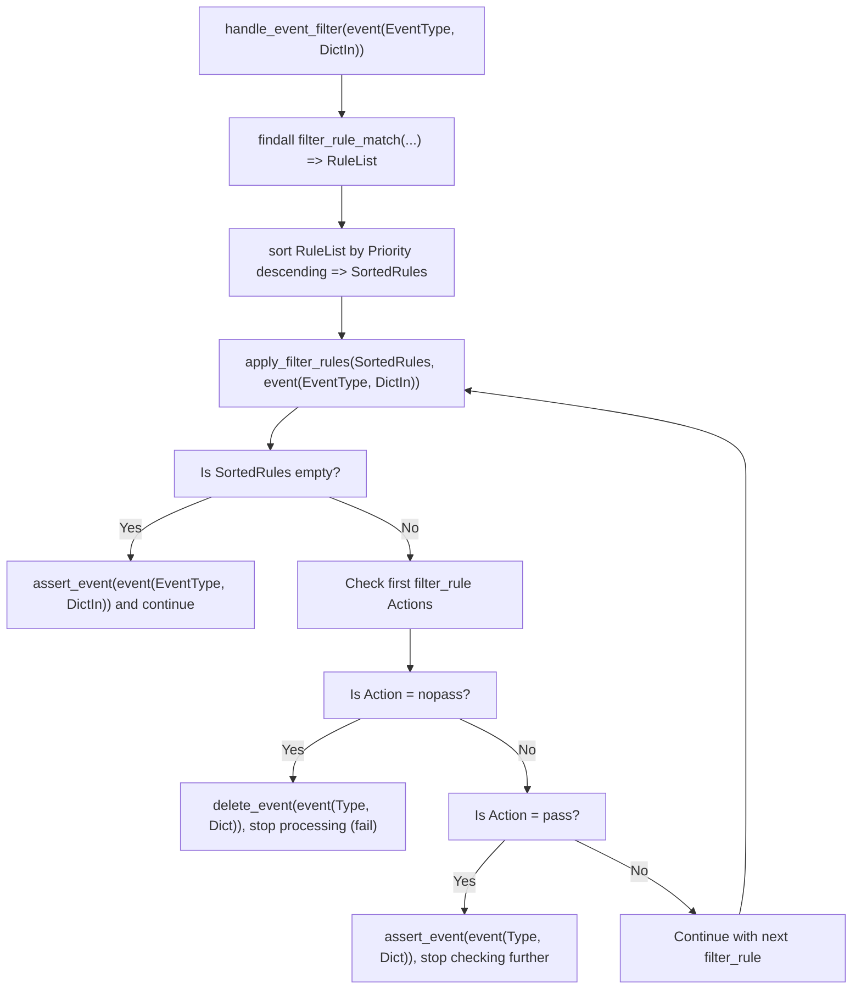

```mermaid
flowchart TD
    A["handle_event_filter(event(EventType, DictIn))"] --> B["findall filter_rule_match(...) => RuleList"]
    B --> C["sort RuleList by Priority descending => SortedRules"]
    C --> D["apply_filter_rules(SortedRules, event(EventType, DictIn))"]
    
    %% apply_filter_rules details integrated
    D --> E1["Is SortedRules empty?"]
    E1 -- Yes --> E2["assert_event(event(EventType, DictIn)) and continue"]
    E1 -- No --> E3["Check first filter_rule Actions"]
    
    E3 --> F1["Is Action = nopass?"]
    F1 -- Yes --> F2["delete_event(event(Type, Dict)), stop processing (fail)"]
    F1 -- No --> F3["Is Action = pass?"]
    
    F3 -- Yes --> F4["assert_event(event(Type, Dict)), stop checking further"]
    F3 -- No --> F5["Continue with next filter_rule"]
    
    F5 --> D

```
